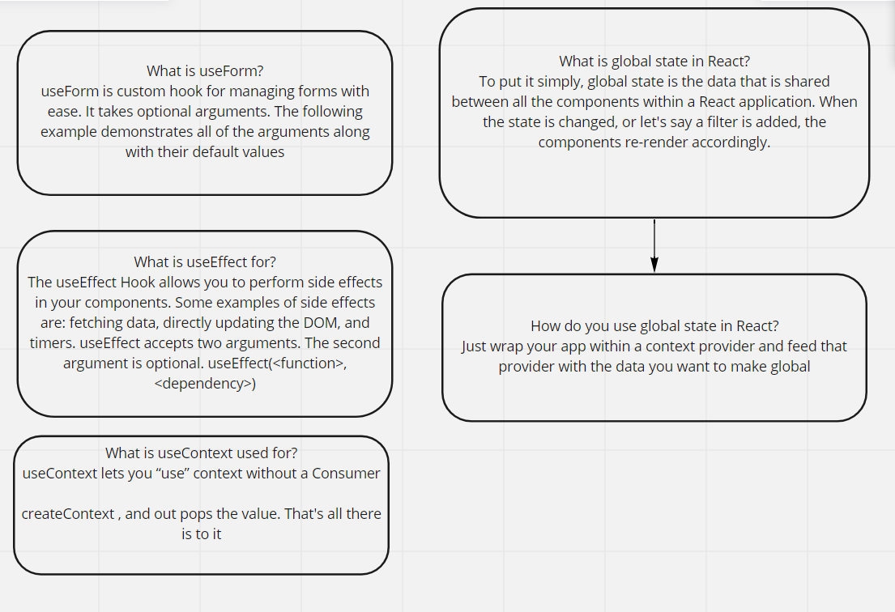

todo-app
LAB - Context API
Author
raneem abu jamous

### one way of using global states in React by using context API. that done by creating, providing, wrapping, and consumming the context.

### useForm is a custom hook that contains a function that will be called when you click on the submit button, and will handle onSumbit and onchange functions.

## TO-DO App Phase 1:

In Phase 1, we’re going to perform some refactoring of the To Do application as built by another team. This application mixes application state and user settings at the top level and passes things around. It was a good proof of concept, but we need to make this production ready.
adding a global state by context-API
adding a pagination.
adding style from BluePrint UI.

## TO-DO App Phase 2:

Description : this phase was refactoring and editing on TO DO App by :
converting all class components to functional ones.
adding settings to edit and control the context.
save the selection to local storage.
using React Browser Route

## Phase 3: Adding security and access controls to the application.

## Phase 4: Integrating with a live API.

